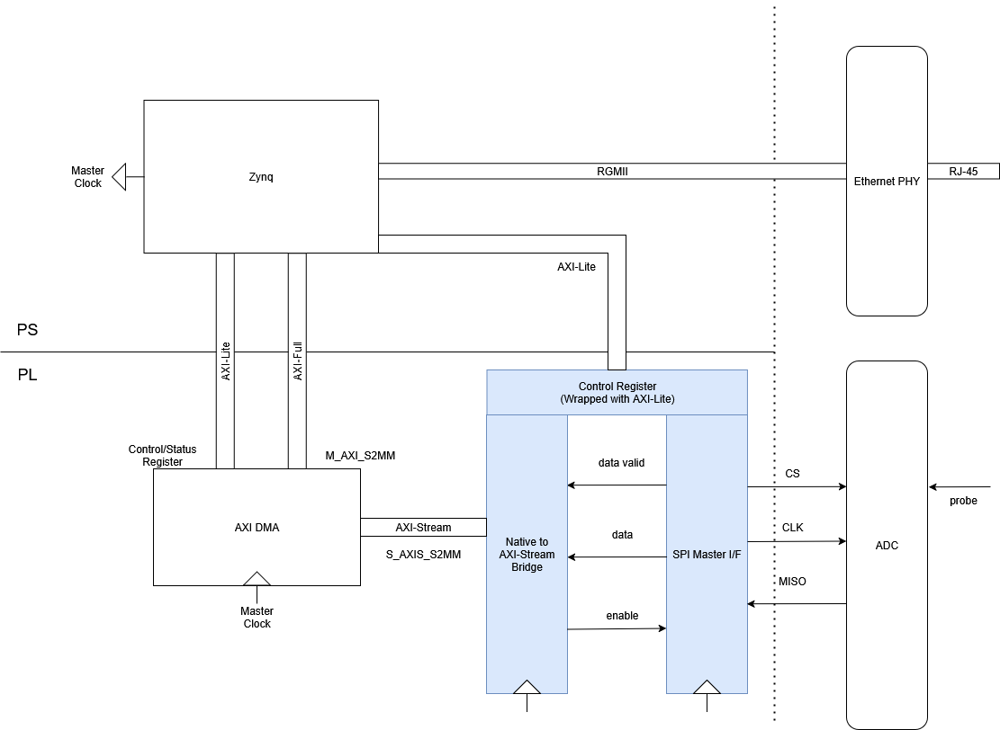
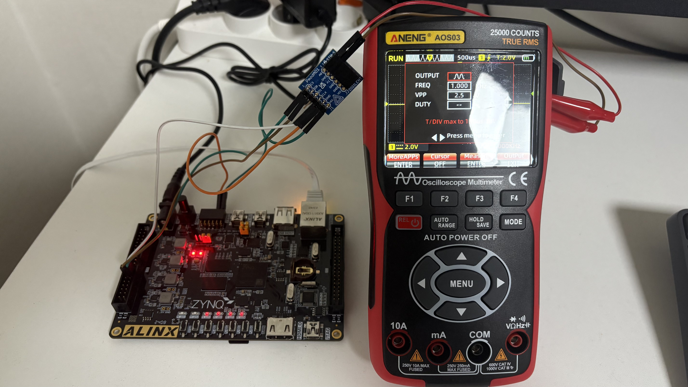
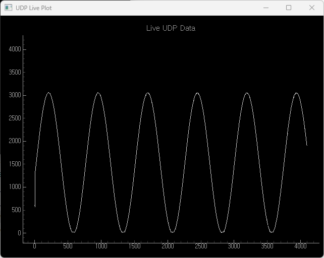

# Oscilloscope Project with Zynq SoC

#### Disclaimer
All source code in this repository is written for personal projects and portfolio purposes only.
It does not reuse any proprietary or company-owned code, and there are no copyright or license issues.

## Summary
| Items               | Description |
|---------------------|-----------------------------------------------------------------|
| **Objective**       | Making a **simple Oscilloscope using ADC and Zynq-7000** development board |
| **Duration**        | 2025.06 – 2025.08 (about 2 months) |
| **Author**          | 김현진 |
| **Tools**           | Xilinx Vivado, Vitis |
| **Languages**       | Verilog/SystemVerilog (RTL), C (firmware), Python (PC application) |
| **Designed Modules**| SPI Master, AXI-Stream Master, AXI-Lite Slave |

## System Architecture

## Device Setup
1. **Zynq-7000 development board**: [AX7010](https://www.en.alinx.com/Product/SoC-development-Boards/Zynq-7000-SoC/AX7010.html)
2. **ADC module**: [PMOD AD1](https://digilent.com/reference/pmod/pmodad1/start)

## Details
- Using 3rd party ADC module (**SPI** interface)
- Using AXI DMA to send ADC data to PS memory (DDR3)
- Using **PS Ethernet** (GEM) as a UDP transmitter
- Controlled via **AXI-Lite**

## Performance & Features
- 100MHz PL side master clock
- SPI Frequency control (up to 16.67 MHz)
- 16-bit SPI: 4-bit dummy + **12-bit ADC resolution**
- Sampling rate is up to **833 kSPS**
- DMA burst size and UDP payload size control

## Results Demo

[▶ Watch a short demo video here](https://youtu.be/XPUGRlwrt3E)

## Future Works
1. Dynamic control (on/off, prescalor, burst size, etc.) and status read with ethernet receiver

## Reference
1. [Pmod AD1 Reference Manual](https://digilent.com/reference/pmod/pmodad1/reference-manual)
2. [AD7476 Datasheet](https://www.analog.com/media/en/technical-documentation/data-sheets/ad7476a_7477a_7478a.pdf)
3. [AX7010 Development Board User Manual](https://cqsrdbo4fm8.feishu.cn/wiki/IiJ7wIorkin5wsk4Jy0chXvVnqf)
4. [AXI DMA LogiCORE IP Product Guide (PG021)](https://docs.amd.com/r/en-US/pg021_axi_dma/Introduction)
5. [Zynq 7000 SoC Technical Reference Manual](https://docs.amd.com/r/en-US/ug585-zynq-7000-SoC-TRM)